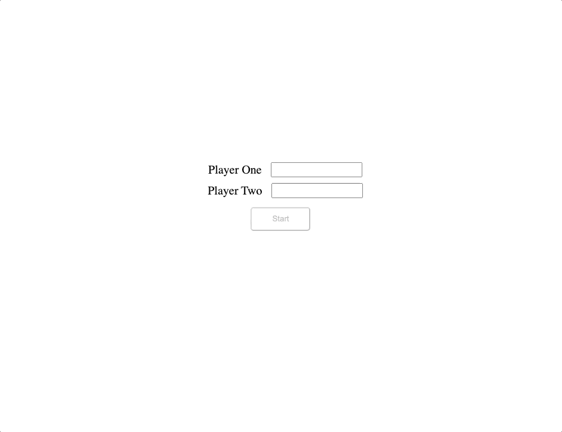

# Tic-Tac-Toe-Project

> This project consist on a simple web app where you can play Tic Tac Toe with a friend.

[*The Odin Project*](https://www.theodinproject.com/courses/javascript/lessons/tic-tac-toe-javascript).

## Built With

- JS ES6.
- HTML.
- CSS3.

## Live Demo
[Live version :rocket:](https://rawcdn.githack.com/davitomix/Tic-Tac-Toe-Project/e5218b93ad649f3552e5908d848ddc27c1b41f62/index.html).

## Getting Started
- Download the repo in your computer.
- Drag and drop the index.html file into your web browser.
- Have fun! :)

## Authors

👤 **David Eli Martinez Garcia**

- Github: [@davitomix](https://github.com/davitomix)
- Linkedin: [linkedin](https://linkedin.com/linkedinhandle)

👤 **Feber Castellon Gallardo**

- Github: [@cochabambinoski](https://github.com/cochabambinoski)
- Linkedin: [linkedin](https://www.linkedin.com/in/cochabambino/)

## 🤝 Contributing

Contributions, issues and feature requests are welcome!

Feel free to check the [issues page](issues/).

## Show your support

Give a ⭐️ if you like this project!

## 📝 License

This project is [MIT](https://opensource.org/licenses/MIT) licensed.
